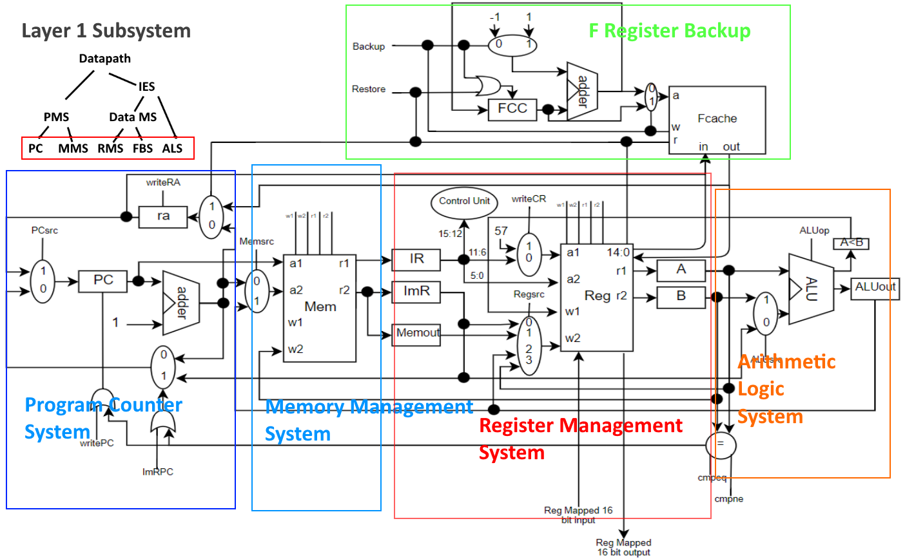

# BAEJ

BAEJ is a Reduced Instruction Set Computer Architecture which implements a load store architecture

## Registers

|Registers | Address | Use |
| --- | --- | --- |
|.f0 - .f14|0-14|General purpose 'function registers' where data is not lost after a function call|
|.ip|15|Register file mapped 16 bit input port|
|.op | 16 | Register file mapped 16 bit output port |
|.t0 - .t27|17-44|General purpose 'temporary registers' where data may be overridden during a function call|
|.a0 - .a5 |45-50|Argument registers for function calls|
|.m0 - .m5 |51-56|Accumulator register on which default mathematical operations are committed|
|.cr       |57|Compiler register|
|.pc       |58|Program counter register|
|.v0 - .v1 |59-60|Return value register from a function call|
|.ra       |61|Return address register|
|.sp       |62|Stack pointer register|
|.z0       |63|Register always holding the value 0|

### Function Registers
Function registers in BAEJ architecture serve as registers which can be safely used during any function without backing up on a stack. In order to reduce the requirements imposed on the user, backing up and restoring the first 16 registers in our register file (.f0- .15) happens automatically to an internal memory unit, called the Fcache, upon function calls and returns. For the user to make a function call, they simply need to move all of their values that they expect to be saved into the F registers. Upon return from the function call, the user's values will be safely returned to the F registers via the Fcache. 

## Machine Code Formats

**I Types**	

|<sup>15</sup> OPCODE <sup>12</sup>|<sup>11</sup>    RS    <sup>6</sup>|<sup>5</sup>    RD    <sup>0</sup>|	(1<sup>st</sup> word)

|<sup>15</sup>                  IMMEDIATE                   <sup>0</sup>|	(2<sup>nd</sup> word)

>I type instructions use the format above. They are multi-word instructions with the first word consisting of a 4 bit op code followed by two 6 bit register addresses. The second word will be the 16 bit immediate value used in the instruction.

**G Types**	

|<sup>15</sup> OPCODE <sup>12</sup>|<sup>11</sup>    RS    <sup>6</sup>|<sup>5</sup>    RD    <sup>0</sup>|	(1<sup>st</sup> word)

> G type instructions use the same format as I type as described above. They do not, however, have an immediate and only have one word in their machine code format.

## Instructions

|Instruction|Type|OP|Usage|Description|Rtl|
|-----------|----|--|-----|-----------|---|
|```lda```|I Type|0000|```lda .rs[immediate] .rd```|Loads a value from memory to rd|```rd=Mem[rs+immediate]```|
|```ldi```|I Type|0001|```ldi .rd immediate```|Loads an immediate to rd|```rd=immediate```|
|```str```|I Type|0010|```str .rs[immediate] .rd```|Stores value in rd to memory|```Mem[rs+immediate]=rd```|
|```bop```|I Type|0011|```bop immediate```|Changes pc to immediate|```pc=immediate```|
|```cal```|I Type|0100|```cal immediate```|Changes pc to immediate and sets a return address|```ra=pc+4```<br>```pc=immediate```|
|```beq```|I Type|0101|```beq .rs .rd immediate```|Changes pc to immediate if rs and rd are equal|```if rs==rd```<br>&nbsp;&nbsp;&nbsp;&nbsp;&nbsp;&nbsp;```pc=immediate;```|
|```bne```|I Type|0110|```bne .rs .rd immediate```|Changes pc to immediate if rs and rd aren't equal|```if rs!=rd```<br>&nbsp;&nbsp;&nbsp;&nbsp;&nbsp;&nbsp;```pc=immediate;```|
|```sft```|I Type|0111|```sft .rs .rd immediate```|Shifts value in rs to rd by immediate. Positive shifts left, negative shifts right|```rd=rs<<immediate```|
|```cop```|G Type|1000|```cop .rs .rd```|Copies the value of rs to rd while retaining the original value of rs|```rd=rs```|
|```slt```|G Type|1010|```slt .rs .rd```|Sets cr to a value other than 0 if rs is less than rd|```cr=rs<rd?1:0```|
|```ret```|G Type|1011|```ret```|Sets pc to the value in ra|```pc=ra```|
|```add```|G Type|1100|```add .rs [.rm]```|Adds rs into the accumulator*|``` [rm]+=rs```|
|```sub```|G Type|1101|```sub .rs [.rm]```|Subtracts rs from the accumulator*|```[rm]-=rs```|
|```and```|G Type|1110|```and .rs [.rm]```|Ands rs with the accumulator*|```[rm]^=rs```|
|```orr```|G Type|1111|```orr .rs [.rm]```|Ors rs with the accumulator*|```[rm]|=rs```|
***optional argument of .rm specifies an accumulator register to operate on (defaults to .m0)**

## Function Calls

Function calls are made easy with BAEJ. When calling a function the programmer simply places the arguments in registers a0 - a5 and uses the command ```cal <FUNCTION>```. The instruction will jump the program counter to the address of the function while also putting the previous value of the program counter plus 2 into the return address register. The function will then return with ```ret``` which returns to the address in the ra register. The programmer can expect their data in f registers to be retained while they should not expect data in any other register to be retained. After a function returns, returned values will be in the v registers.

## Examples


### Common Assembly/Machine Language Fragments
#### Loading an address into a register
##### BAEJ Code
```assembly
ldi	.f0	addr
lda	.f0[0] .f1		
```
##### Machine Code Translation (assuming the value stored in addr is 280)
```
0x00			0001 000000 000000
0x02			0000 000100 011000
0x04 			0000 000000 000001
0x06			0000 000000 000000
```


#### Sum Values from x (a0) to y (a1) assuming x < y
##### BAEJ Code
```assembly
		cop	.a0 .m0
		cop .a0 .m1
		ldi	.f0 1
loop:	add .f0 .m1
		add	.m1
		slt	.m1 .a1
		bne	.z0 .cr loop
```

##### Machine Code Translation (Assuming the address of loop is 0x8)
```
0x00			1000 101101 110011
0x02			1000 101101 110100
0x04	 		0001 000000 000000
0x06			0000 000000 000001
0x08	loop:	1100 000000 110100
0x0A			1100 110100 110011
0x0C			1010 110100 101110
0x0E			0110 111111 111001
0x00			0000 000000 001000
```


### Modulus
##### BAEJ Code
```assembly
loop:	add	.a1
		slt	.a0	.m0
		bne	.z0	.cr	loop
		sub	.a1
		cop	.a0	.m1
		sub	.m0	.m1
```

##### Machine Language Translation (Assuming the address of loop is at 0x0)
```
0x00	loop:	1100 101110 110011
0x02			1010 101101 110011
0x04			0110 111111 111001
0x06			0000 000000 000000
0x08			1101 101110 110011
0x0A			1000 101101 110011
0x0C			1101 110011 110100
```


### Euclid's Algorithm
#### C Code
```c
// Find m that is relatively prime to n.
int
relPrime(int n)
{
   int m;

   m = 2;

   while (gcd(n, m) != 1) {  // n is the input from the outside world
     m = m + 1;
   }

   return m;
}

// The following method determines the Greatest Common Divisor of a and b
// using Euclid's algorithm.
int
gcd(int a, int b)
{
  if (a == 0) {
    return b;
  }

  while (b != 0) {
    if (a > b) {
      a = a - b;
    } else {
      b = b - a;
    }
  }

  return a;
}
```
#### BAEJ Translation
```asm
# Greatest common divisor
gcd:	bne .a0 .z0 cont
		cop .a1 .v0
		ret
		
		cop .a0 .m0			# Copy arguments into accumulators
		cop .a1 .m1

cont:	beq .m1 .z0 end		# While b != 0
		slt .m1 .m0
		beq .cr .z0 else	# If a > b
		sub .m1
		bop cont
		
else:	sub .m0 .m1			# Else
		bop cont
		
end:	cop .m0 .v0
		ret
		
# Relative prime
relP:	ldi .m0 2			# .m0 stores value of m
							# .a0 stores value of n
loop:	cop .m0 .a1				
		cal gcd
		ldi .t1 1
		beq .v0 .t1 done	# While gcd(n,m) != 1
		add .t1				# m = m + 1
		bop loop

done:	cop .m0 .v0
		ret					# return m
```
#### Machine Code Translation
```
0x00	relP:	0001 110011 000000
0x02			0000 000000 000010
0x04	loop:	1000 110011 101110
0x06			0100 000000 000000
0x08			0000 000000 011100	# address[gcd]
0x0A			0001 010001 000000
0x0C			0000 000000 000001
0x0E			0101 111011 010001
0x10			0000 000000 011000	# address[done]
0x12			1100 010001 000000
0x14			0011 000000 000000
0x16			0000 000000 000100	# address[loop]
0x18	done:	1000 110011 111011
0x1A			1011 000000 000000
0x1C	gcd:	0110 101101 111111
0x1E			0000 000000 101000	# address[cont]
0x20			1000 101110 111011
0x22			1011 000000 000000
0x24			1000 101101 110011
0x26			1000 101110 110100
0x28	cont:	0101 110100 111111
0x2A			0000 000000 111110	# address[end]
0x2C			1010 110100 110011
0x2E			0101 111010 111111
0x30			0000 000000 111000	# address[else]
0x32			1101 110100 000000
0x34			0011 000000 000000
0x36			0000 000000 101000	# address[cont]
0x38	else:	1101 110011 110100
0x3A			0011 000000 000000
0x3C			0000 000000 101000	# address[cont]
0x3E	end:	1000 101101 111011
0x40			1011 000000 000000

```


## RTL

#### I Types


<table>
    <thead>
    	<th><code>lda</code></th>
    	<th><code>str</code></th>
    	<th><code>ldi</code></th>
    	<th><code>beq/bne</code></th>
    	<th><code>sft</code></th>
    	<th><code>bop</code></th>
    	<th><code>cal</code></th>
    </thead>
    <tbody>
        <tr>
            <td colspan=7>IR = Mem[PC]<br>ImR = Mem[Wire(pc+1)]<br>PC += 1</td>
        </tr>
        <tr>
            <td colspan=5>PC += 1<br>A = Reg[IR[11:6]]<br>B = Reg[IR[5:0]]</td>
            <td>PC = ImR</td>
            <td>ra = PC + 1<br>PC = ImR</td>
        </tr>
        <tr>
            <td colspan=2>ALUout = A + ImR</td>
            <td>Reg[IR[5:0]] = ImR</td>
            <td>if(A==B)<br>PC = ImR</td>
            <td>ALUout = A &lt;&lt; ImR</td>
            <td>Cycle Delay</td>
            <td>Fcache[FCC] = Reg[15:0]<br>FCC += 1</td>
        </tr>
        <tr>
            <td>Memout = Mem[ALUout]</td>
            <td>Mem[ALUout] = B</td>
            <td colspan=2></td>
            <td>Reg[IR[5:0]] = ALUout</td>
            <td colspan=2></td>
        </tr>
        <tr>
        	<td>Reg[IR[5:0]] = Memout</td>
        	<td colspan=6></td>
        </tr>
    </tbody>
</table>


#### G Types


<table>
    <thead>
    	<th><code>cop</code></th>
    	<th><code>slt</code></th>
    	<th><code>Other G Types</code></th>
    	<th><code>ret</code></th>
    </thead>
    <tbody>
        <tr>
            <td colspan=4>IR = Mem[PC]<br>PC += 1</td>
        </tr>
        <tr>
            <td colspan=3>A = Reg[IR[11:6]]<br>B = Reg[IR[5:0]]</td>
            <td>PC = ra<br>FCC -= 1</td>
        </tr>
        <tr>
            <td>Reg[IR[5:0]] = A</td>
            <td>AlessThanB = A < B ? 1 : 0</td>
        	<td>ALUout = A op B</td>
            <td>Reg[15:0] = Fcache[FCC]</td>
        </tr>
        <tr>
        	<td></td>
            <td>cr = ALessThanB</td>
            <td>Reg[IR[5:0]] = ALUout</td>
            <td></td>
        </tr>
    </tbody>
</table>


### Testing our RTL
#### Code Tracing
The first the we did when writing RTL to verify is a code tracing exercise. Before the RTL is accepted we trace the logic and values through our RTL. If it gives expected results we then can move on to below for further testing if needed.

#### Simulation

Java will be used to simulate the RTL, such that variables will represent registers, a Java Map will represent the register and storage files (with addresses mapped to their respective values), and multiplication will represent bit shifting. For example, an implementation of lda, according to our RTL, will be implemented using the following Java code.

```
 int IR;
 int IMR;
 int PC;
 int ALUout;
 int Memout;
 int A;
 int B;
 
 HashMap<Integer, Integer> Mem;
 HashMap<Integer, Integer> Reg;
 
 public void lda () {
     IR = Mem.get(PC);
     IMR = Mem.get(PC + 1);
     PC += 1;
     // -----------------------
     PC += 1;
     A = Reg.get(IR >> 6 & 0b00111111); // IR[11:6];
     B = Reg.get(IR >> 0 & 0b00111111); // IR[5:0];
     // -----------------------
     ALUout = A + IMR;
     // -----------------------
     Memout = Mem.get(ALUout);
     Reg.put(Memout, Reg.get(IR & 0b00111111)); // IR[5:0];
 }
```

A similar implementation will be done for other instructions. Once the instruction set is complete, if the RTL is correct, the executed simulation should be able to comfortably solve Relative Prime.

## Hardware Components

#### Adder

| Items                       | Descriptions                                                 |
| --------------------------- | ------------------------------------------------------------ |
| **Inputs**                  | A[15:0], B[15:0]                                             |
| **Outputs**                 | R[15:0]                                                      |
| **Control Signals**         | None                                                         |
| **Functionality**           | Outputs A+B onto R                                           |
| **Hardware Implementation** | In Verilog, assign A+B to the output R                       |
| **Unit Tests**              | Input all permutations of two integers from -20 to 20 and verifies the output is the correct number you get when the inputs are added |

#### Single bit Multiplexer

| Items                       | Descriptions                                                 |
| --------------------------- | ------------------------------------------------------------ |
| **Inputs**                  | A[15:0], B[15:0]                                             |
| **Outputs**                 | R[15:0]                                                      |
| **Control Signals**         | S                                                            |
| **Functionality**           | Will constantly put the value of A or B specified by the S control bit onto R |
| **Hardware Implementation** | Verilog switch case, which assigns A to R given a low signal for S, otherwise, assigns B to R |
| **Unit Tests**              | Put all permutations of -10 to 10 on A and B and attempts to select A then B while testing that the correct output is on R |

#### Two bit Multiplexer

| Items                       | Descriptions                                                 |
| --------------------------- | ------------------------------------------------------------ |
| **Inputs**                  | A[15:0], B[15:0], C[15:0], D[15:0]                           |
| **Outputs**                 | R[15:0]                                                      |
| **Control Signals**         | S[1:0]                                                       |
| **Functionality**           | Will constantly put the value of A, B, C, D specified by the S control bit onto R |
| **Hardware Implementation** | Verilog switch case, which given 0, 1, 2, or 3, assigns A, B, C, or D to R respectively. |
| **Unit Tests**              | Put all permutations of 4 numbers each from -10 to 10 on A, B, C, and D and attempts to select A, then B, then C, and finally D while testing that the correct output is on R |

#### ALU

| Items                       | Descriptions                                                 | ALU op | Operation     |
| --------------------------- | ------------------------------------------------------------ | ------ | ------------- |
| **Inputs**                  | A[15:0], B[15:0]                                             | 000    | AND           |
| **Outputs**                 | A<B, R[15:0]                                                 | 001    | OR            |
| **Control Signals**         | Operation[2:0]                                               | 010    | ADD           |
| **Functionality**           | Takes the mathematical operation specified by Operation and preforms in on operand A and B, puts result on A<B or R depending on operation | 011    | SUBTRACT      |
| **Hardware Implementation** | Verilog switch case that assigns the result of the appropriate operation on A and B to R based off of the op code | 100    | SHIFT         |
| **Unit Tests**              | A loop in Verilog for each op code which inputs all permutations of two inputs from -20 to 20 and verifies with the output that the operation was preformed correctly on the inputs | 101    | SET LESS THAN |

#### Comparator

| Items                       | Descriptions                                                 |
| --------------------------- | ------------------------------------------------------------ |
| **Inputs**                  | A[15:0], B[15:0]                                             |
| **Outputs**                 | R                                                            |
| **Control Signals**         | Cmpeq, Cmpne                                                 |
| **Functionality**           | Whenever the cmpeq signal is high, outputs a 1 on R if A == B, when cmpne is high, outputs a 1 on R if A != B, otherwise a 0 is output on R. |
| **Hardware Implementation** | Verilog module which assigns A==B if cmpeq is high, A!=B if cmpne is high, otherwise 0 to R |
| **Unit Tests**              | A loop in verilog which inputs a range of values A and B and checks the output for each control signal ensuring it is what should be expected. |

#### Fcache

| Items                       | Descriptions                                                 |
| --------------------------- | ------------------------------------------------------------ |
| **Inputs**                  | dataIn[255:0], B[15:0]                                       |
| **Outputs**                 | dataOut[255:0]                                               |
| **Control Signals**         | Write, Read                                                  |
| **Functionality**           | When the Write signal is high, takes the value on dataIn and stored it in address B, when the Read signal is high, puts the value at B on dataOut |
| **Hardware Implementation** | Static storage implemented using a register-file like structure. Use the verilog register file provided on the course website altering it to 256 bit words. In verilog, write a module which wraps the register file to allow for a bus serving as both input and output. |
| **Unit Tests**              | A loop in verilog which goes through a large range of addresses and writes many different 256 bit values while reading them each iteration to ensure they are correct. |

#### Register File

| Items                       | Descriptions                                                 |
| --------------------------- | ------------------------------------------------------------ |
| **Inputs**                  | A1[15:0], A2[15:0], W1[15:0], W2[15:0], Fin[255:0]           |
| **Outputs**                 | R1[15:0], R2[15:0], Fout[255:0]                              |
| **Control Signals**         | Write1, Write2, Read1, Read2, ioIn, ioOut, Backup, Restore   |
| **Functionality**           | With a Write signal high, takes the respective value (W1 or W2) and stores it in the respective address (A1 or A2). With a Read signal high, takes the value at the respective address and puts it onto the respective output (R1 or R2). When Backup is high, puts the values in registers 0 to 15 on Fout, when Restore is high, stores the values on Fin into registers 0 to 15. |
| **Hardware Implementation** | Static storage implemented using a series of registers. Use the verilog register file provided on the course website and alter as needed to enable dual port functionality (Multiple inputs and outputs). |
| **Unit Tests**              | A loop in verilog which goes through a large range of addresses and writes many 16 bit values while reading them each iteration to ensure they are correct. |

#### Memory Unit

| Items                       | Descriptions                                                 |
| --------------------------- | ------------------------------------------------------------ |
| **Inputs**                  | A1[15:0], A2[15:0], W1[15:0], W2[15:0]                       |
| **Outputs**                 | R1[15:0], R2[15:0]                                           |
| **Control Signals**         | Write1, Write2, Read1, Read2                                 |
| **Functionality**           | With a Write signal high, takes the respective value (W1 or W2) and stores it in the respective address (A1 or A2). With a Read signal high, takes the value at the respective address and puts it onto the respective output (R1 or R2) |
| **Hardware Implementation** | Implemented in verilog using the Memory unit provided on the course website, altering it as needed to enable dual port functionality (Multiple inputs and outputs). |
| **Unit Tests**              | A loop in verilog which goes through a large range of addresses and writes many 16 bit values while reading them each iteration to ensure they are correct. |


## Integrating and Testing the Components

### Integration Plan

| Subsystem                        | Composition                                                  |
| -------------------------------- | ------------------------------------------------------------ |
| **Program Counting System**      | Register (x2), Single bit Multiplexer (x2), Adder, Or-gate   |
| **Memory Management System**     | Memory Unit, Single bit Multiplexer, Register (x3)           |
| **Register Management System**   | Register File, Single bit Multiplexer, Two bit Multiplexer, Register (x2) |
| **Fcache Backup System**         | Fcache, Single bit Multiplexer (x2), Adder, Register, Or-gate |
| **Arithmetic and Logic System**  | ALU, Single bit Multiplexer, Register (x2)                   |
| **Program Management System**    | Program Counting System, Memory Management System            |
| **Data Management System**       | Register Management System, Fcache Backup System             |
| **Instruction Execution System** | Data Management System, Arithmetic and Logic System          |
| **Datapath**                     | Program Management System, Instruction Execution System      |

### Datapath Block Diagram with Subsystems



### Test Plans

| Subsystem                              | Test Plan                                                    |
| -------------------------------------- | ------------------------------------------------------------ |
| **Program Counting System** (PCS)      | Run the system through a few clock cycles to test that it correctly increments by one each time. Also ensure that we can write pc + 1 to ra. Once this is verified, inject addresses from a set of addresses, and from register ra, to test branching functionality. |
| **Memory Management System **(MMS)     | Input values into a sequential block of memory then read from the same block, verifying that each read gives the output registers the correct values that were written. |
| **Register Management System** (RMS)   | Input values into registers from all permutations of the input ports, then read from registers with known values verifying that each read gives the output registers the correct values. |
| **Fcache Backup System** (FBS)         | Conduct multiple Backups of known values to a sequential block in the Fcache memory, then using multiple restores, read back the same block verifying the output is what was written. |
| **Arithmetic and Logic System** (ALS)  | Conduct all possible ALU operations on a wide range of input values using all possible input methods (i.e. different ALUsrc signals to the multiplexer). Test each operation for correct output values. |
| **Program Management System** (PMS)    | Hard-code values into a sequential block of memory then allow the program counter to increment through memory and verify that the correct values which were written to memory are written to the output registers. |
| **Data Management System** (DMS)       | Repeatedly write values to registers 0 - 15 using many permutations of input methods. Each time all 16 registers are filled, send a backup control signal. Do this many times then conduct the same number of restores, ensuring values are correct along the way. |
| **Instruction Execution System** (IES) | Give this system the control signals needed for basic instructions which don't require memory such as arithmetic operations and moving values around in the register file. Include many different input values with each set of control signals and verify that the output is whats expected. |
| **Datapath**                           | Develop a set of test cases for each instruction and run them through the system and verify that the results are as expected. After these test have passed we can implement simple code blocks and algorithms to test more complex processes. |

## Control

### Control Unit

| Items                       | Descriptions                                                 |
| --------------------------- | ------------------------------------------------------------ |
| **Inputs**                  | A[3:0]                                                       |
| **Outputs**                 | B[23:0]                                                      |
| **Control Signals**         | Reset (Author's notes)                                       |
| **Functionality**           | Given an op-code (or address) the unit outputs a value on B corresponding to the control signals needed by the instruction |
| **Hardware Implementation** | Implemented as a ROM in verilog which takes in a counter value and op |
| **Unit Tests**              | A loop in Verilog which puts every permutation of the 4-bit op-codes and Reset control bit on A and Reset, then tests that the output control signals is what is expected |

### Control Signals

|Signal Name|Bits|Effect when deasserted (0)|Effect when asserted (1)|
| --- | --- | --- |---|
|PCsrc|1|PC is set to default value (PC+1) or ImR|PC is set to the value of ra|
|writePC|1|Nothing|PC gets the value chosen by PCsrc mux |
|writeRA|1|Nothing|Ra gets the value of PC + 1|
|ImRPC|1|ImRPC mux chooses PC+1|ImRPC mux chooses immediate value (only when comparator is enabled and determines A=B)|
|Memsrc|1|Address 1 in Mem is pulled from PC + 1|Address 1 in Mem is pulled from ALUout|
|MemW1|1|Nothing|The value at port w1 is written to the address specified by a1|
|MemW2|1|Nothing|The value at port w2 is written to the address specified by a2|
|MemR1|1|Nothing|The value at the address specified by a1 is read to port r1|
|MemR2|1|Nothing|The value at the address specified by a2 is read to port r2|
|writeCR|1|The reg number specified at reg file port a1 is IR[11:6] (default)|The reg number specified at reg file port a1 is 57 (for compiler register)|
|Regsrc|2|0 - Value at reg file port w2 comes from ImR; 1 - Value at port w2 comes from MemOut|2 - Value at port w2 comes from ALUout; 3 - Value at port w2 comes from reg A|
|writeImR|1|Nothing|ImR gets the value read from memory at the address specified by a2|
|backup|1|Nothing|Registers 15:0 (256 bits) from the reg file are written to the Fcache at the address specified by "a"; FCC is incrememented by 1|
|restore|1|Nothing|The 256 bit value at the address specified by "a" in the Fcache is written to registers 15:0 in the reg file; FCC is decremented by 1|
|RegW1|1|Nothing|The value at port w1 is written to the reg address specified by a1|
|RegW2|1|Nothing|The value at port w2 is written to the reg address specified by a2|
|RegR1|1|Nothing|The value at the reg address specified by a1 is read to port r1|
|RegR2|1|Nothing|The value at the reg address specified by a2 is read to port r2|
|ALUsrc|1|2nd ALU operand comes from ImR|2nd ALU operand comes from reg B|
|ALUop|3|SEE ALU IN COMPONENTS|SEE ALU IN COMPONENTS|
|cmpeq|1|Nothing|The result of the comparison A=B is sent to the ImPCsrc mux|
|cmpne|1|Nothing|The result of the comparison A!=B is sent to the ImPCsrc mux|

### FSM Diagram


